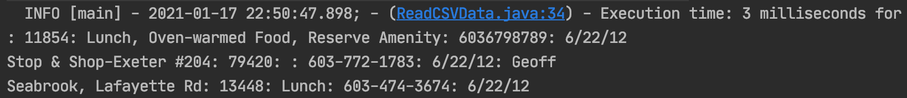
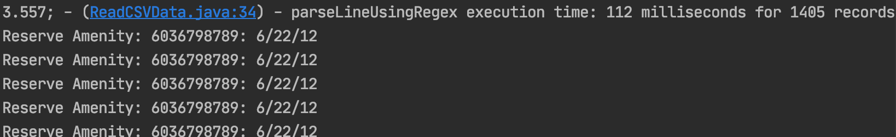
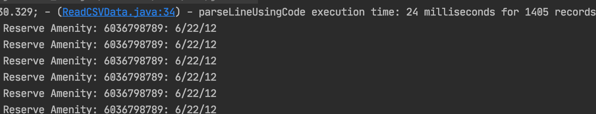

# myCsvParser


Requirements:

* It only needs to parse single lines at a time, and each line is independent of the others. i.e. There is no need to ensure lines have the same number of arguments.
* It must support comma as the field separator.
* It must support quotes strings with embedded commas.

## Part 1: Build a Basic CSV File Processor Using an Available Library

#### Step 1.1 Basic Code Structure

##### Requirements:

* Process a line at a time. Isolate the parser into a function.
* Demonstrate TDD.
* Write a test mode to feed a series of tests into the parser function and validate the output.
  Testing:
* Write a number of test inputs and outputs. Use colon as the separator on the outputs to avoid any confusion. (Do not use colon in any test data.)

##### Evaluation:

* Is the test data sufficient? Did you check for quoted strings? Multiple quoted strings on the same line?

  csv corner cases

  https://softwareengineering.stackexchange.com/questions/65126/unit-tests-for-a-csv-parser

  https://github.com/maxogden/csv-spectrum

* Does the parser pass all tests?

* Write a number of test inputs and outputs. Use colon as the separator on the outputs to avoid any confusion. (Do not use colon in any test data.)
  e.g.

  Input A,B,"C",D --> Output: A:B:C:D


  Input A, "B,C", D --> Output A:B,C:D

#### Step 1.2 Performance Baseline (Control Loop)

Add timing checks to establish a performance benchmark for the processor when run across various sample sizes.

##### Requirements:

* Establish code that measures the execution time (microseconds) for X iterations over the parsing function.
* Separate the parsing function from the control code.
* Establish a mechanism to support alternate parsing functions.

##### Evaluation:

* All tests pass. A performance baseline is established for 1000 iterations.
* The code is reviewed for correctness and simplicity.


#### Step 1.3 Result

###### Test sample data

Input csv = 4 rows

```
Name,Store Number,Features,Phone Number,Insert Date,Owner
,11854,"Lunch, Oven-warmed Food, Reserve Amenity",6036798789,6/22/12
Stop & Shop-Exeter #204,79420,,603-772-1783,6/22/12,"Geoff"
"Seabrook, Lafayette Rd", 13448,"Lunch",603-474-3674,6/22/12
```

Output 



###### Test data using different code strategies

Added more records to compare the performance. 

Now input csv = 1400+ records

Parser.class include two methods, same input and output, different logic:

1. Method1  using regex

   Slow.

   Need about 112 milliseconds to parse 1400 records. 

   

2. Method2 using the code, logic, for loop, if else

   Fast.

   Need about 24 milliseconds to parse 1400 records. 

   

   